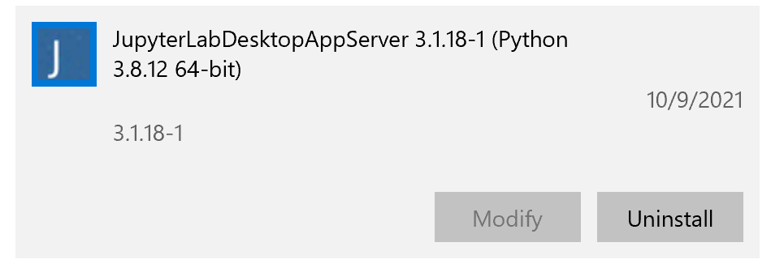

# Customizing the Bundled Python Environment

JupyterLab Desktop is a self-contained standalone desktop application which bundles a Python environment. The bundled Python environment comes with several popular Python libraries to make the App ready to use in scientific computing and data science workflows. These packages are `numpy`, `scipy`, `pandas`, `ipywidgets` and `matplotlib`. In order to install additional packages into JupyterLab Desktop's Python environment, you need to follow certain steps during and after the installation as described below.

## Linux Instructions

On Linux, JupyterLab Desktop is installed into `/opt/JupyterLab` and Python environment is created in `/opt/JupyterLab/resources/jlab_server`

- Install the App by double clicking the installer file and wait for the installation to finish.
- Linux installs JupyterLab Desktop as the root user. That's why it is necessary to change the ownership to the current user to be able to customize JupyterLab Desktop's Python environment.
- Before launching JupyterLab Desktop, open a Terminal and run the following command with your `username` to change App file system ownership.
```bash
sudo chown -R username:username /opt/JupyterLab
```

## macOS Instructions

On macOS, JupyterLab Desktop should be installed into `~/Applications/JupyterLab` for current user in order to allow environment customizations. Python environment is created in `~/Applications/JupyterLab.app/Contents/Resources/jlab_server`.

- Make sure you install the App for current user in order to allow changes to App's Python environment. It is not the default location of the installer, you can set it by following these steps

| Change Install Location  | Install for me only |
| ------------- | ------------- |
|  |  |


## Windows Instructions

On Windows, JupyterLab Desktop should be installed to default install location `C:\JupyterLab\`. There will be two installers running during setup. Keep the default paths for both installers. Python environment is created in `C:\JupyterLab\resources\jlab_server`.

# Installing New Python Packages

Make sure you installed JupyterLab Desktop following the steps outlined above in order to have required permissions to install new Python packages.

- Open a Notebook and run the command below in a cell for the package you want to install. You will see the log of the installation process as the cell output.
  ```bash
  %pip install <package_name>
  ```
  For example: to install scikit-learn
  ```bash
  %pip install scikit-learn
  ```
- In order to use the newly installed package you need to restart your active notebook's kernel or create a new notebook

# Uninstalling JupyterLab Desktop

## Debian, Ubuntu Linux
For versions 3.1.13-1 and older
```bash
sudo apt-get purge jupyterlab-app
```
For versions 3.1.18-1 and newer
```bash
sudo apt-get purge jupyterlab-desktop # remove application
rm /usr/bin/jlab # remove command symlink
```


## Red Hat, Fedora, SUSE Linux
For versions 3.1.13-1 and older
```bash
sudo rpm -e jupyterlab_app
```
For versions 3.1.18-1 and newer
```bash
sudo rpm -e jupyterlab-desktop # remove application
rm /usr/bin/jlab # remove command symlink
```

## macOS
Find the application installation `JupyterLab.app` in Finder (in ~/Applications or /Applications) and move to Trash by using `CMD + Delete`. Clean other application generated files using:

For versions 3.1.13-1 and older
```bash
rm -rf ~/Library/Application\ Support/jupyterlab_app
```
For versions 3.1.18-1 and newer
```bash
rm -rf ~/Library/Application\ Support/jupyterlab-desktop
rm /usr/local/bin/jlab # remove command symlink
```

## Windows

On Windows, JupyterLab Desktop is installed in two parts, one for the python environment and another for the application itself. Go to `Windows Apps & Features` dialog using `Start Menu` -> `Settings` -> `Apps` and make sure to uninstall the components in the following order:

- First uninstall JupyterLab Desktop python environment. Note that for JupyterLab Desktop version 3.1.13-1 and older, this component will be named `JupyterLabAppServer` but for newer versions it will be named `JupyterLabDesktopAppServer`.


- Then uninstall JupyterLab Desktop application

